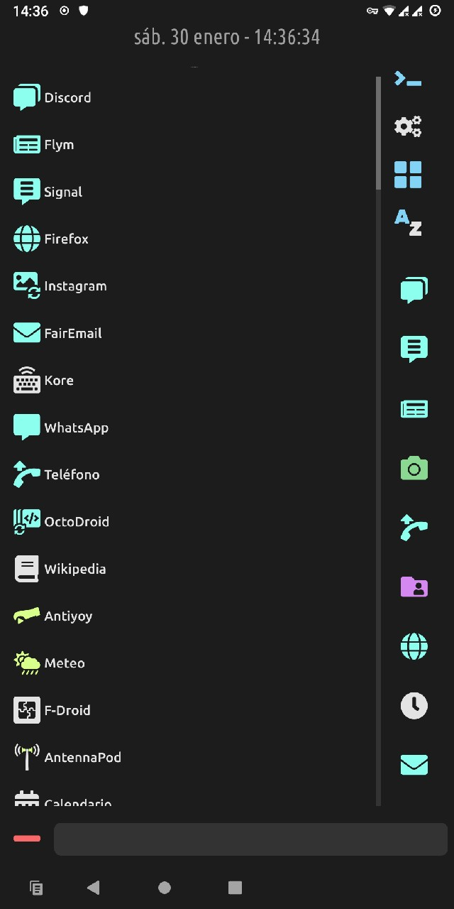

# First use

When you've just installed *RxLauncher*, all applications will be given the same default icon.

{: style="height:64px" }

This is to let you customize the launcher as you wish, you will be able to change the icon of each app individually.

{: style="height:720px" }

## Options

On the top right bar, 4 buttons allow you to customize RxLauncher and change the view.

- {: style="height:32px" }  
Show the console. The console is a way for you to know what's going on on your phone and in *RxLauncher*. You can keep track of your use of the applications (the number of times you've launched them is shown), and for now *RxLauncher* monitors and shows you apps installation and removal. In the future, it may show other useful information.  
 
- {: style="height:32px" }  
Open the [settings](settings.md).  
 
- {: style="height:32px" } | {: style="height:32px" }  
Show the applications in a list or in a grid.  
 
- {: style="height:32px" } | {: style="height:32px" }  
Sort the applications either by name or by the number of times you launched them.s

You can long-press any application icon to change the [application settings](appsettings.md).

{: style="height:720px;"}